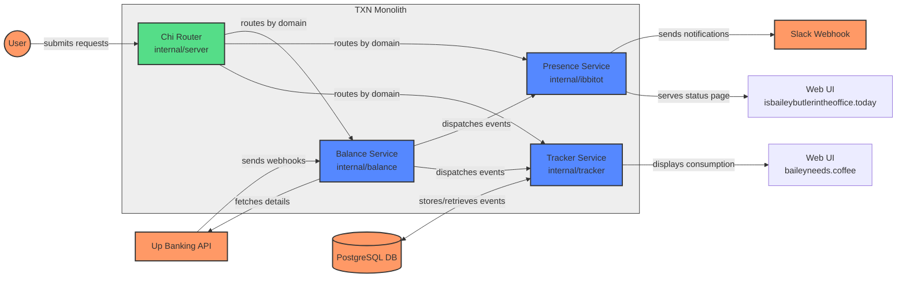

# TXN

TXN is a multi-service Go application that connects to the Up Banking API to monitor transaction activity. The application analyzes purchase patterns to provide useful insights and notifications.

## What it does

TXN monitors your banking transactions to:

- **Office Presence Tracking**: Automatically detects when someone has purchased coffee nearby, indicating they are in the office. This helps team members know when colleagues are available for in-person collaboration.
  
- **Caffeine Consumption Monitoring**: Tracks coffee and caffeinated beverage purchases over time, providing insights into consumption patterns and spending habits.
  
- **Real-time Notifications**: Sends updates to Slack when status changes, keeping team members informed without manual check-ins.

This application is particularly valuable for remote-friendly teams who want to coordinate office visits, track spending patterns on beverages, and maintain team awareness through automated notifications.

## Services

The app consists of three main services:

- **Balance Service**: Receives webhooks from Up Banking
- **Presence Service**: Shows if someone is in the office based on coffee purchases
- **Tracker Service**: Records caffeine consumption data

Each service is exposed through its own domain:
- `events.baileys.dev` → Balance Service
- `isbaileybutlerintheoffice.today` → Presence Service
- `baileyneeds.coffee` → Tracker Service

## Getting Started

### Requirements

- Go 1.23+
- PostgreSQL database
- Up Banking account

### Setup

1. Clone the repository
2. Copy environment template: `cp .env.example .env`
3. Update `.env` with your credentials
4. Run locally or with Docker:

```bash
# Local
go run main.go

# Docker
docker-compose up -d
```

## Configuration

Set these environment variables:

| Variable | Description |
|----------|-------------|
| `UP_ACCESS_TOKEN` | Up Banking API token |
| `UP_WEBHOOK_SECRET` | Webhook validation secret |
| `SLACK_WEBHOOK` | Slack notification URL |
| `DB_USER` | PostgreSQL username |
| `DB_PASSWORD` | PostgreSQL password |
| `DB_HOST` | PostgreSQL hostname |
| `DB_PORT` | PostgreSQL port (default: 5432) |
| `DB_NAME` | PostgreSQL database name |

## Project Structure

```
internal/
  ├── common/        # Shared utilities
  ├── balance/       # Up Banking webhook handler
  ├── ibbitot/       # Office presence tracker 
  ├── tracker/       # Transaction tracker
  └── server/        # HTTP server
```

## System Architecture

The following diagram shows how components interact within the system:



### Data Flow

1. **Up Banking → Balance Service**: 
   - Up Banking sends transaction webhooks to the Balance Service
   - Balance Service validates and enriches transaction data

2. **Balance Service → Service Handlers**:
   - Distributes `TransactionEvent` to registered services
   - Each service filters relevant transactions

3. **Presence Service**:
   - Determines office presence based on coffee purchases
   - Updates web UI and sends Slack notifications

4. **Tracker Service**:
   - Records caffeine consumption in PostgreSQL
   - Calculates caffeine levels and provides visualization

## Development

See [CLAUDE.md](CLAUDE.md) for development guidelines.
